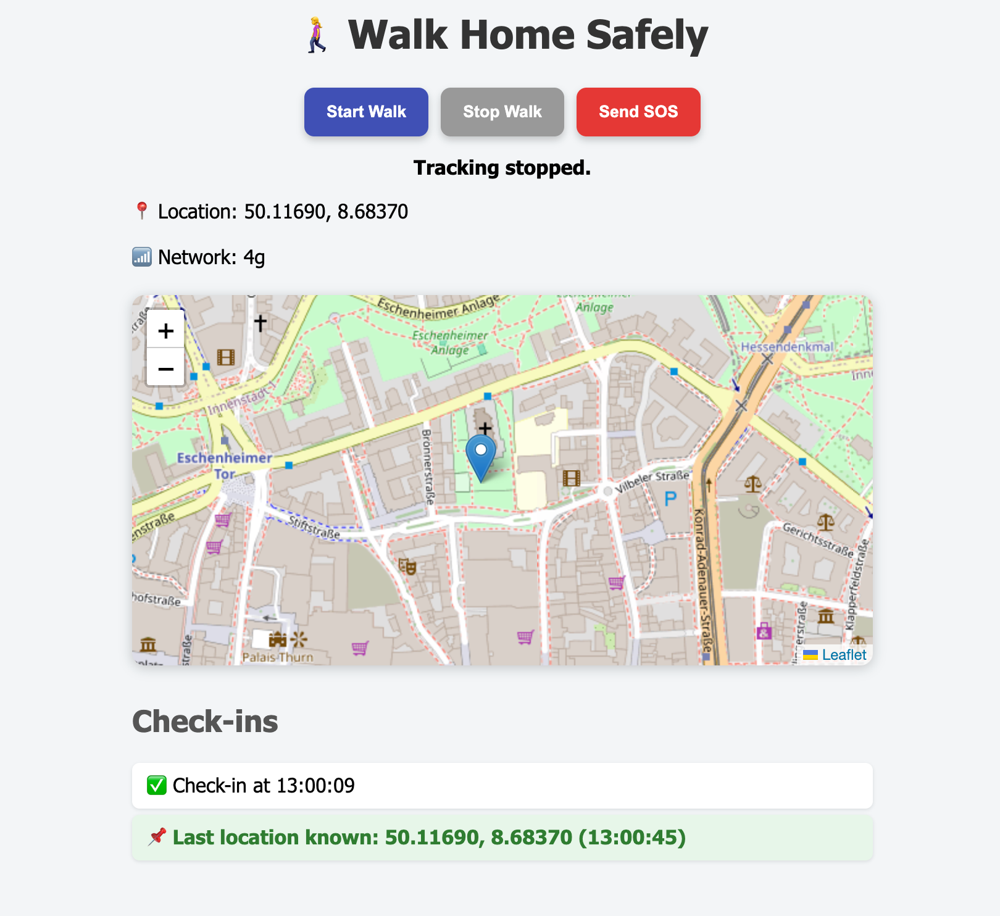

# WalkSafe

A modern web application that helps you walk home safely by sharing your live location with family and friends and providing emergency features.

---

## Features

 - Real-time location tracking on a map  
 - Shareable tracking link for family & friends to view your live location  
 - "Send SOS" feature to alert contacts and generate a downloadable SOS badge  
 - Check-ins log with smooth fade-in animations  
 - Network connectivity status monitoring  
 - Last known location shown when walk stops  

---

## Web APIs used

| API                      | Usage                                 |
|--------------------------|---------------------------------------|
| **Geolocation API**      | Track live location.                 |
| **Network Information API** | Show connection type & alert on slow/unstable networks. |
| **Intersection Observer API** | Animate check-ins smoothly. |
| **Canvas API**           | Generate SOS badge image (downloadable). |

---

### User flow

1️⃣ User clicks **Start Walk** — app starts tracking location and shows a **shareable link**.  
2️⃣ Family/friends open the link (viewer page) to see live location updates.  
3️⃣ User can click **Send SOS** to highlight an emergency and generate a badge.  
4️⃣ User stops the walk — app shows last known location and route.  

---

## Shareable tracking link

When a walk starts, a **unique session ID** is generated.  
- Example link: `https://yourdomain.com/track.html?sessionId=abc123`
- Friends visiting this link can see your location live on a map.

---

 

